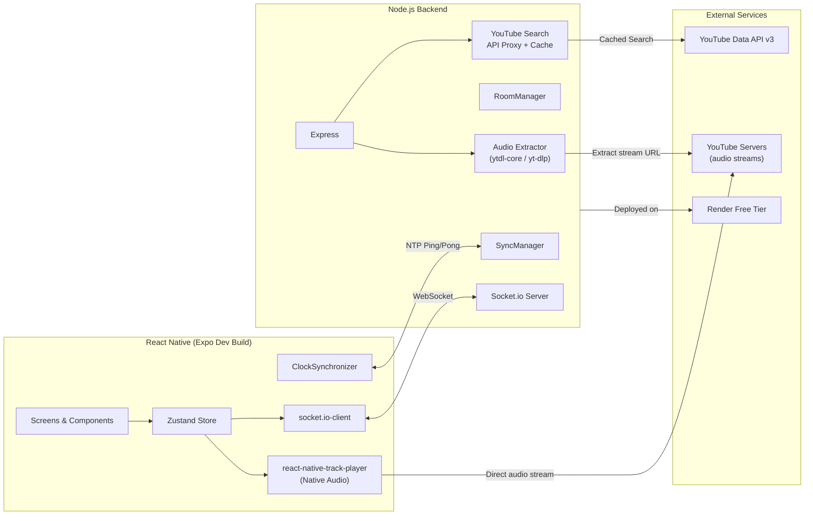
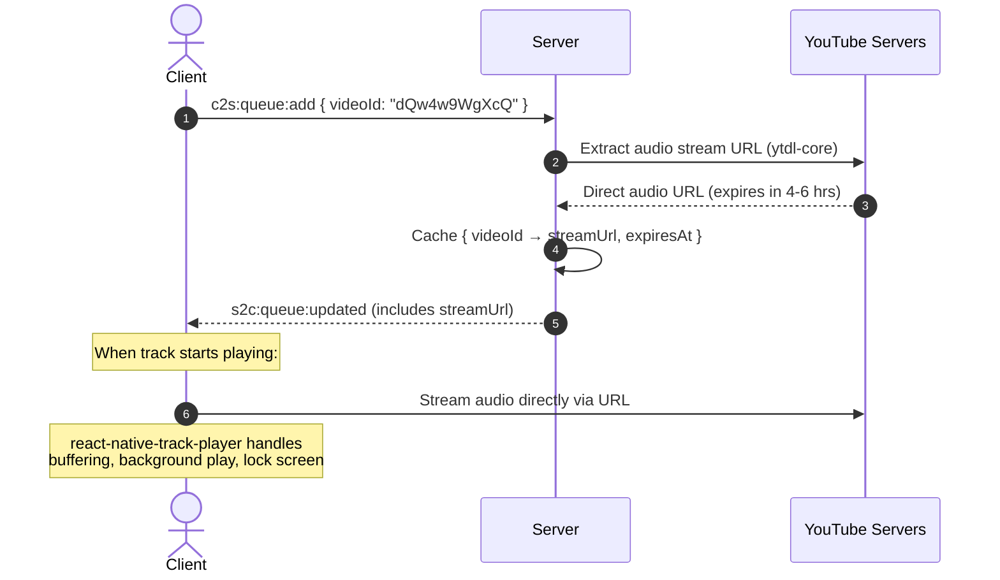
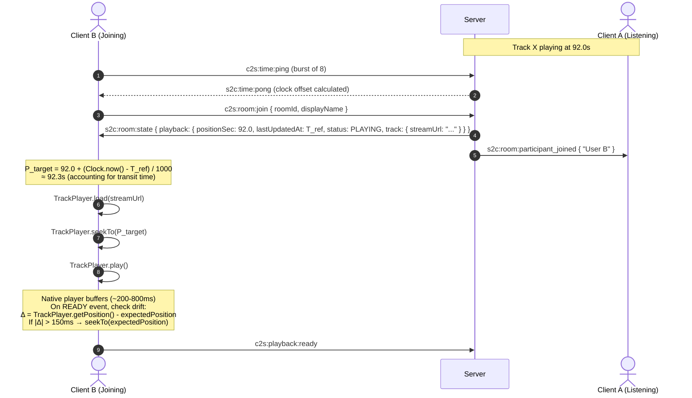

# SyncRoom — Implementation Plan (v2)

A real-time music listening party app where friends join a shared room, queue songs from YouTube, and hear them in sync while chatting together. Completely free to build and host.

> [!IMPORTANT]
> **v2 Change:** Playback engine switched from YouTube IFrame (WebView) to **server-side audio extraction + `react-native-track-player`**. This enables background audio, lock screen controls, and tighter sync — but means audio-only (no video) and cannot be published to app stores.

---

## User Review Required

> [!IMPORTANT]
> **Playback control model — Host-only vs. Anyone:**
> The prompt left this as "decide". This plan uses **Host + Delegated** control: only the host can play/pause/skip/seek by default, but any participant can add songs to the queue and remove their own songs. This prevents chaos in large rooms while keeping it collaborative. If you want fully democratic controls, the architecture supports flipping a `room.settings.anyoneCanControl` flag — no structural changes needed.

> [!WARNING]
> **App Store / Play Store publishing is not possible with this approach.** Extracting YouTube audio streams violates YouTube ToS. Distribution options:
> - **Android:** APK sideloading, EAS internal distribution
> - **iOS:** Ad-hoc distribution (up to 100 devices), EAS internal distribution, TestFlight (risky — Apple may reject)
> - This is how apps like NewPipe and BlackHole operate — personal/side-project use is fine.

> [!IMPORTANT]
> **YouTube Search API quota is extremely limited:** Only **100 searches/day** across your entire app (all users combined). The plan mitigates this with aggressive backend caching and debouncing, but this is a hard ceiling. If you foresee heavy usage, consider adding a "paste YouTube URL" flow (costs only 1 unit vs 100 for a search).

> [!NOTE]
> **Expo Dev Build required (not Expo Go).** `react-native-track-player` is a native module that requires a custom dev build. This is a one-time setup:
> ```bash
> npx expo prebuild
> npx expo run:android  # or run:ios
> ```

---

## Architecture Overview



### How Audio Extraction Works



The client never touches YouTube's iframe or WebView. It receives a direct audio stream URL and plays it through the OS-native audio pipeline — the same way Spotify, Apple Music, and podcast apps work.

### Core Design Decisions

| Decision | Choice | Why |
|---|---|---|
| Audio playback | `react-native-track-player` v4 | Native OS audio service — background play, lock screen controls, direct position/rate access |
| Audio extraction | `@distube/ytdl-core` (primary) + `yt-dlp` CLI (fallback) | Extracts direct audio stream URLs from YouTube. `@distube/ytdl-core` is the actively maintained fork |
| State management | Zustand v5 | Direct state access from socket callbacks, 1.1 KB, minimal boilerplate |
| Real-time transport | Socket.io v4.8 | Room abstraction built-in, auto-reconnect, works in React Native |
| Clock sync | NTP-style 4-timestamp with min-RTT selection | Sub-50ms accuracy achievable, compensates for asymmetric latency |
| Sync tolerance | **150ms deadband** (improved from 300ms) | No more WebView bridge — native player gives direct position access |
| Drift correction | **Continuous rate slewing** (1.03x / 0.97x) | Native player supports arbitrary playback rates with pitch preservation |
| Server state | In-memory `Map<string, RoomState>` | No database for MVP — rooms are ephemeral |
| YouTube search | Backend proxy with in-memory cache | Protects the 100 searches/day quota |
| Hosting | Render free tier | 750 free hours/month, WebSocket connections prevent sleep |

### Why This Is Better Than YouTube IFrame (For Sync)

| Metric | YouTube IFrame (v1) | Native Track Player (v2) |
|---|---|---|
| `getCurrentTime()` latency | 30–150ms (PostMessage bridge) | **<1ms** (native API) |
| Playback rate control | Discrete `[0.25, 0.5, 0.75, 1, 1.25, 1.5, 2]` | **Continuous** (e.g., `1.03x`, `0.97x`) |
| Sync deadband | 300ms | **150ms** |
| Drift correction | Micro-seeks (causes re-buffering) | **Rate slewing** (imperceptible) |
| Background audio | ❌ Impossible | ✅ Native OS support |
| Lock screen controls | ❌ None | ✅ Play/pause/skip in notification + lock screen |
| Seek precision | Snaps to nearest I-frame (1–2s) | **Exact byte-level seek** |
| Ads | YouTube injects ads, desyncs users | **No ads** (direct audio stream) |

---

## Project Structure

```
SongSync/
├── app/                          # React Native (Expo Dev Build) frontend
│   ├── app.json
│   ├── package.json
│   ├── tsconfig.json
│   ├── App.tsx                   # Entry point, navigation setup
│   ├── src/
│   │   ├── screens/
│   │   │   ├── HomeScreen.tsx        # Create/join room
│   │   │   ├── RoomScreen.tsx        # Main room: player + queue + chat
│   │   │   └── SearchScreen.tsx      # YouTube search modal
│   │   ├── components/
│   │   │   ├── Player.tsx            # Track player UI + album art + controls
│   │   │   ├── NowPlaying.tsx        # Thumbnail, title, artist, progress bar
│   │   │   ├── Queue.tsx             # Song queue list
│   │   │   ├── Chat.tsx              # Live chat messages
│   │   │   ├── ParticipantList.tsx   # Who's in the room
│   │   │   └── SearchResult.tsx      # Single search result card
│   │   ├── stores/
│   │   │   ├── roomStore.ts          # Room state (participants, host, code)
│   │   │   ├── playerStore.ts        # Playback state (track, playing, timestamp)
│   │   │   ├── queueStore.ts         # Song queue
│   │   │   └── chatStore.ts          # Chat messages
│   │   ├── services/
│   │   │   ├── socketService.ts      # Socket.io singleton + AppState handler
│   │   │   ├── clockSync.ts          # NTP-style clock synchronizer
│   │   │   ├── trackPlayerService.ts # react-native-track-player setup + remote events
│   │   │   └── api.ts                # HTTP calls (YouTube search, stream URL)
│   │   ├── hooks/
│   │   │   ├── useSocket.ts          # Socket event binding hook
│   │   │   └── useSyncedPlayer.ts    # Drift detection + rate slewing loop
│   │   ├── utils/
│   │   │   └── constants.ts          # Event names, server URL, config
│   │   └── types/
│   │       └── index.ts              # Shared type definitions
│   └── assets/
│
├── server/                       # Node.js backend
│   ├── package.json
│   ├── tsconfig.json
│   ├── src/
│   │   ├── index.ts              # Express + Socket.io server bootstrap
│   │   ├── roomManager.ts        # Room CRUD, participant management
│   │   ├── syncManager.ts        # Playback state, clock sync handlers
│   │   ├── queueManager.ts       # Queue operations
│   │   ├── chatManager.ts        # Chat message relay
│   │   ├── audioExtractor.ts     # YouTube audio stream URL extraction
│   │   ├── youtubeProxy.ts       # YouTube Data API search proxy + cache
│   │   ├── validation.ts         # Zod schemas for all socket payloads
│   │   ├── types.ts              # Shared server types
│   │   └── utils.ts              # Room code generator, helpers
│   └── Dockerfile                # For Render deployment
│
├── Docs/
│   └── prompt.md
├── .gitignore
└── README.md
```

---

## Server-Side Room State Design

The server is **authoritative** — it owns the truth about what's playing and when.

### Data Model

```typescript
// server/src/types.ts

export type PlaybackStatus = 'PLAYING' | 'PAUSED' | 'IDLE';

export interface TrackMetadata {
  videoId: string;           // YouTube video ID (11 chars)
  title: string;
  channelName: string;
  durationSec: number;
  thumbnailUrl: string;
  addedBy: string;           // display name of who queued it
  streamUrl: string;         // Direct audio stream URL (extracted by server)
  streamExpiresAt: number;   // Server timestamp (ms) when stream URL expires
}

export interface PlaybackState {
  track: TrackMetadata | null;
  status: PlaybackStatus;
  positionSec: number;       // Track position at `lastUpdatedAt`
  lastUpdatedAt: number;     // Server timestamp (ms) when position was recorded
  playbackRate: number;      // 1.0 = normal (used for coordinated rate changes)
  epoch: number;             // Monotonic counter — increments on every state change
}

export interface Participant {
  userId: string;            // Generated UUID on join
  socketId: string;
  displayName: string;
  isHost: boolean;
  joinedAt: number;          // Server timestamp
}

export interface ChatMessage {
  id: string;
  userId: string;
  displayName: string;
  text: string;
  timestamp: number;
}

export interface RoomState {
  roomId: string;            // 6-char alphanumeric code
  hostId: string;            // userId of current host
  playback: PlaybackState;
  queue: TrackMetadata[];
  participants: Map<string, Participant>;
  chat: ChatMessage[];       // Last 100 messages (ring buffer)
  createdAt: number;

  // Internal timers (not sent to clients)
  hostDisconnectTimer: NodeJS.Timeout | null;
  trackEndTimer: NodeJS.Timeout | null;
  emptyRoomTimer: NodeJS.Timeout | null;
}
```

### The Position Function

Playback position is modeled as a **continuous function of time**, not a polled number. Both server and clients use the same formula:

```typescript
export function calculateCurrentPosition(
  playback: PlaybackState,
  currentServerTime: number
): number {
  if (playback.status !== 'PLAYING' || !playback.track) {
    return playback.positionSec;
  }

  const elapsedSec = ((currentServerTime - playback.lastUpdatedAt) / 1000) * playback.playbackRate;
  const currentPos = playback.positionSec + elapsedSec;

  return Math.min(Math.max(0, currentPos), playback.track.durationSec);
}
```

> [!TIP]
> This is the key insight: instead of constantly broadcasting "we're at 45.2s... 45.7s... 46.1s...", the server broadcasts **"we were at 45.0s at timestamp T"** and every client independently computes where the track *should* be right now. This eliminates the need for frequent sync broadcasts during normal playback.

### Audio Stream Extraction

```typescript
// server/src/audioExtractor.ts
import ytdl from '@distube/ytdl-core';

interface StreamInfo {
  streamUrl: string;
  expiresAt: number;      // ms timestamp
  durationSec: number;
}

// Cache: videoId → { streamUrl, expiresAt }
const streamCache = new Map<string, StreamInfo>();

export async function getAudioStreamUrl(videoId: string): Promise<StreamInfo> {
  // Return cached if not expired (with 10 min safety margin)
  const cached = streamCache.get(videoId);
  if (cached && cached.expiresAt - Date.now() > 10 * 60 * 1000) {
    return cached;
  }

  const info = await ytdl.getInfo(`https://www.youtube.com/watch?v=${videoId}`);
  
  // Select best audio-only format (no video = smaller, faster)
  const audioFormat = ytdl.chooseFormat(info.formats, {
    quality: 'highestaudio',
    filter: 'audioonly',
  });

  // Extract expiry from URL params (YouTube stream URLs contain an `expire` param)
  const url = new URL(audioFormat.url);
  const expireParam = url.searchParams.get('expire');
  const expiresAt = expireParam ? parseInt(expireParam) * 1000 : Date.now() + 4 * 60 * 60 * 1000;

  const result: StreamInfo = {
    streamUrl: audioFormat.url,
    expiresAt,
    durationSec: parseInt(info.videoDetails.lengthSeconds),
  };

  streamCache.set(videoId, result);
  return result;
}

// Re-extract if a stream URL has expired or is about to
export async function refreshStreamIfNeeded(track: TrackMetadata): Promise<TrackMetadata> {
  if (track.streamExpiresAt - Date.now() < 10 * 60 * 1000) {
    const fresh = await getAudioStreamUrl(track.videoId);
    return { ...track, streamUrl: fresh.streamUrl, streamExpiresAt: fresh.expiresAt };
  }
  return track;
}
```

> [!NOTE]
> **Why `@distube/ytdl-core`?** The original `ytdl-core` is unmaintained. `@distube/ytdl-core` is the actively maintained community fork with regular fixes for YouTube's anti-bot changes. Fallback to `yt-dlp` CLI (Python) can be added if the Node library breaks.

---

## Socket.io Event Schema

Every event follows the naming convention:
- `c2s:<domain>:<action>` — Client → Server (commands)
- `s2c:<domain>:<action>` — Server → Client (broadcasts)

### Complete Event Table

#### Room Lifecycle

| Event | Direction | Payload | Description |
|---|---|---|---|
| `c2s:room:create` | C→S | `{ displayName: string }` | Create a room, sender becomes host |
| `s2c:room:created` | S→C | `{ roomId, userId, roomState }` | Confirms creation, returns room code |
| `c2s:room:join` | C→S | `{ roomId: string, displayName: string }` | Join an existing room |
| `s2c:room:state` | S→C | `{ roomState }` | Full room state snapshot (sent to joiner) |
| `s2c:room:participant_joined` | S→C | `{ participant }` | Broadcast to existing members |
| `c2s:room:leave` | C→S | `{ roomId }` | Graceful leave |
| `s2c:room:participant_left` | S→C | `{ userId, newHostId? }` | Broadcast; includes new host if migration occurred |
| `c2s:room:rejoin` | C→S | `{ roomId, userId }` | Reconnect after socket drop |
| `s2c:room:host_transferred` | S→C | `{ newHostId, newHostName }` | Host migration notification |
| `s2c:room:error` | S→C | `{ code, message }` | Room not found, room full, etc. |

#### Clock Synchronization

| Event | Direction | Payload | Description |
|---|---|---|---|
| `c2s:time:ping` | C→S | `{ t1: number }` | Client transmit timestamp |
| `s2c:time:pong` | S→C | `{ t1, t2, t3: number }` | Server receive + transmit timestamps |

#### Playback Control

| Event | Direction | Payload | Description |
|---|---|---|---|
| `c2s:playback:play` | C→S | `{ roomId }` | Host requests play |
| `c2s:playback:pause` | C→S | `{ roomId }` | Host requests pause |
| `c2s:playback:seek` | C→S | `{ roomId, targetSec, clientEpoch }` | Host seeks to position |
| `c2s:playback:skip` | C→S | `{ roomId }` | Host skips to next in queue |
| `c2s:playback:ready` | C→S | `{ roomId }` | Client has buffered, ready to play |
| `c2s:playback:track_ended` | C→S | `{ roomId }` | Client's player reached end of track |
| `s2c:playback:sync` | S→C | `PlaybackState` | Authoritative state update (pause, seek, etc.) |
| `s2c:playback:start_at` | S→C | `PlaybackState & { scheduledServerTime }` | Coordinated play — "start at this server time" |
| `s2c:playback:track_changed` | S→C | `{ playback, queue }` | New track started (auto-advance or skip) |

#### Queue

| Event | Direction | Payload | Description |
|---|---|---|---|
| `c2s:queue:add` | C→S | `{ roomId, videoId, title, channelName, thumbnailUrl }` | Anyone can add a song (server extracts stream URL) |
| `c2s:queue:remove` | C→S | `{ roomId, videoId, userId }` | Remove own song (or any if host) |
| `s2c:queue:updated` | S→C | `{ queue: TrackMetadata[] }` | Full queue after modification |

#### Chat

| Event | Direction | Payload | Description |
|---|---|---|---|
| `c2s:chat:message` | C→S | `{ roomId, text }` | Send a chat message |
| `s2c:chat:message` | S→C | `ChatMessage` | Broadcast message to room |

---

## The Sync Problem — Solved

This is the hardest engineering challenge. The native track player makes it significantly easier than the YouTube IFrame approach.

### Step 1: Clock Synchronization (NTP-Style)

When a client connects, it performs a burst of 8 ping-pong exchanges to calculate its clock offset from the server:

```
Client                          Server
  |                                |
  |--- t1 (client send time) ---->|  t2 (server receive time)
  |                                |  t3 (server send time)
  |<--- { t1, t2, t3 } ----------|
  |  t4 (client receive time)     |
```

$$\text{RTT} = (t_4 - t_1) - (t_3 - t_2)$$
$$\theta = \frac{(t_2 - t_1) + (t_3 - t_4)}{2}$$

The sample with the **minimum RTT** is selected (least queueing delay = most symmetric = most accurate). A background re-sync runs every 45s with EWMA smoothing ($\alpha = 0.2$) to track oscillator drift.

**After sync, the client can estimate server time at any moment:**
$$t_{\text{server}} = t_{\text{client\_local}} + \theta$$

### Step 2: Join Mid-Song (Non-Blocking Catch-Up)

When User B joins a room where User A is 1:32 into a song:



**Phase 1 — Estimated Seek:** Client B calculates where the track *should* be right now using the synchronized clock and loads the audio stream at that position.

**Phase 2 — Post-Buffer Correction:** When the native player reports READY/PLAYING, the client re-checks drift. If drift exceeds 150ms (due to buffering time), it performs one corrective seek. Native seeks are precise (no I-frame snapping like video).

### Step 3: Play/Pause/Seek Propagation

**Pause flow:**
1. Host taps pause → `c2s:playback:pause`
2. Server snapshots current position: `positionSec = calculateCurrentPosition(playback, Date.now())`
3. Server sets `status = 'PAUSED'`, increments `epoch`
4. Server broadcasts `s2c:playback:sync` with new `PlaybackState`
5. All clients call `TrackPlayer.pause()` and update stores

**Play flow (coordinated start):**
1. Host taps play → `c2s:playback:play`
2. Server sets a **scheduled start time** 300ms in the future: `scheduledServerTime = Date.now() + 300`
3. Server broadcasts `s2c:playback:start_at { ...playbackState, scheduledServerTime }`
4. Each client waits until `clockSync.now() >= scheduledServerTime`, then calls `TrackPlayer.play()`
5. Because all clients share the same synchronized clock, they all start within ~50ms of each other

> [!TIP]
> The 300ms lead time is the key to sub-200ms sync. Instead of "play now" (which arrives at different times for different clients), "play at T" lets every client independently schedule the exact same moment.

### Step 4: Continuous Drift Correction (Improved in v2)

Every 2.5 seconds during playback, the client checks drift:

$$\Delta = \text{TrackPlayer.getPosition()} - \text{calculateCurrentPosition}(\text{serverState}, \text{clockSync.now()})$$

| Zone | Drift | Action | Why |
|---|---|---|---|
| **Deadband** | $\|\Delta\| \leq 150\text{ms}$ | **Nothing** | Imperceptible. No bridge latency to account for |
| **Rate Slew** | $150\text{ms} < \|\Delta\| \leq 800\text{ms}$ | **Adjust playback rate** to `1.03x` (if behind) or `0.97x` (if ahead) for a calculated duration, then restore `1.0x` | Imperceptible speed change, no audio pop or re-buffer. Gradually closes the gap |
| **Hard Seek** | $\|\Delta\| > 800\text{ms}$ | **`TrackPlayer.seekTo(target)`** | Something went wrong (network drop, app suspended). Snap immediately |

```typescript
// Rate slew calculation
function applySlewCorrection(driftMs: number) {
  const SLEW_RATE = 0.03; // 3% speed adjustment
  const slewDurationMs = Math.abs(driftMs) / SLEW_RATE;
  
  if (driftMs > 0) {
    // Client is ahead — slow down
    TrackPlayer.setRate(1 - SLEW_RATE); // 0.97x
  } else {
    // Client is behind — speed up
    TrackPlayer.setRate(1 + SLEW_RATE); // 1.03x
  }
  
  // Restore normal rate after correction period
  setTimeout(() => {
    TrackPlayer.setRate(1.0);
  }, slewDurationMs);
}
```

> [!TIP]
> **Why this is much better than v1:** YouTube IFrame only accepted discrete rates (`[0.25, 0.5, 0.75, 1, 1.25, 1.5, 2]`), so we had to use micro-seeks that caused re-buffering. The native player supports any rate with built-in pitch preservation — a 3% speed change is completely imperceptible to human ears but closes a 300ms gap in about 10 seconds.

### Step 5: Song Transitions (Dual-Trigger)

Same as v1 — relying only on client track-end events is fragile:

1. **Server safety timer:** When a track starts, server sets a timeout:
   ```
   timeout = ((track.durationSec - positionSec) * 1000) + 1500ms
   ```
2. **Client ended event:** When any client's player fires the track completion event, it emits `c2s:playback:track_ended`
3. **Whichever fires first** triggers queue advancement. The other is cancelled.
4. Server refreshes the next track's stream URL if needed, pops from queue, resets playback state, broadcasts `s2c:playback:track_changed`

### Step 6: Host Disconnect & Migration

- **25-second grace window:** When the host's socket disconnects, the server starts a timer. Playback continues uninterrupted for everyone else.
- **Reconnection:** If the host reconnects within 25s (socket reconnect or `c2s:room:rejoin`), their session is restored.
- **Migration:** After 25s, the participant with the earliest `joinedAt` becomes the new host. Server broadcasts `s2c:room:host_transferred`.

---

## React Native Specific Guidance

### Audio Playback with `react-native-track-player`

[`react-native-track-player`](https://rntp.dev/) v4 provides a native audio service that:
- ✅ Plays audio in the background (screen off, app backgrounded)
- ✅ Lock screen controls (play/pause/skip in notification area)
- ✅ Direct, synchronous-like position access (no PostMessage bridge)
- ✅ Continuous playback rate control with pitch preservation
- ✅ Handles audio focus (pauses when phone call arrives, etc.)
- ⚠️ Requires Expo Dev Build (not compatible with Expo Go)

```bash
npm install react-native-track-player
npx expo prebuild    # Generate native project files
npx expo run:android # Build and run (or run:ios)
```

#### Track Player Service Setup

```typescript
// app/src/services/trackPlayerService.ts
import TrackPlayer, { 
  AppKilledPlaybackBehavior,
  Capability,
  Event,
  RepeatMode 
} from 'react-native-track-player';

export async function setupTrackPlayer() {
  await TrackPlayer.setupPlayer({
    // Buffer config for low-latency sync
    minBuffer: 15,    // seconds
    maxBuffer: 50,
    backBuffer: 10,
  });

  await TrackPlayer.updateOptions({
    capabilities: [
      Capability.Play,
      Capability.Pause,
      Capability.SkipToNext,
      Capability.SeekTo,
    ],
    compactCapabilities: [Capability.Play, Capability.Pause, Capability.SkipToNext],
    android: {
      appKilledPlaybackBehavior: AppKilledPlaybackBehavior.ContinuePlayback,
    },
    // Notification / lock screen metadata
    notificationCapabilities: [Capability.Play, Capability.Pause, Capability.SkipToNext],
  });

  await TrackPlayer.setRepeatMode(RepeatMode.Off);
}

// Load and play a track
export async function loadTrack(track: TrackMetadata) {
  await TrackPlayer.reset();
  await TrackPlayer.add({
    id: track.videoId,
    url: track.streamUrl,
    title: track.title,
    artist: track.channelName,
    artwork: track.thumbnailUrl,
    duration: track.durationSec,
  });
}

// Remote events (lock screen / notification controls)
// These must route through socket → server → broadcast to maintain sync
export async function setupRemoteHandlers(socket: Socket, roomId: string) {
  TrackPlayer.addEventListener(Event.RemotePlay, () => {
    socket.emit('c2s:playback:play', { roomId });
  });

  TrackPlayer.addEventListener(Event.RemotePause, () => {
    socket.emit('c2s:playback:pause', { roomId });
  });

  TrackPlayer.addEventListener(Event.RemoteNext, () => {
    socket.emit('c2s:playback:skip', { roomId });
  });

  TrackPlayer.addEventListener(Event.RemoteSeek, ({ position }) => {
    socket.emit('c2s:playback:seek', { 
      roomId, 
      targetSec: position,
      clientEpoch: usePlayerStore.getState().epoch 
    });
  });
}
```

> [!IMPORTANT]
> **Lock screen controls must go through the server, not control playback directly.** When a user taps "pause" on the lock screen, it emits `c2s:playback:pause` to the server, which broadcasts to all clients. This maintains sync. If we let the lock screen directly pause the local player, that user would pause while everyone else keeps playing.

### Background Audio Handling

Unlike v1 (which had to pause on background), audio now **continues playing** when the app backgrounds:

```typescript
import { AppState } from 'react-native';

AppState.addEventListener('change', (state) => {
  if (state === 'active') {
    // App came to foreground — socket may have disconnected
    if (!socketService.isConnected()) {
      socketService.reconnect();
    }
    // Request fresh room state to catch up on any missed events
    socketService.emit('c2s:room:rejoin', { roomId, userId });
  }
  // No pause on background! Audio continues via native service.
  // Socket.io connection may drop, but track-player keeps playing.
  // Drift controller will re-sync when app returns to foreground.
});
```

### Preventing Screen Sleep (Optional Now)

With background audio working, `expo-keep-awake` is now optional — only use it if you want the screen to stay on for the UI (chat, queue visualization):

```bash
npx expo install expo-keep-awake
```

### Socket.io in React Native

```bash
npm install socket.io-client
```

**Critical settings:**
```typescript
const socket = io(SERVER_URL, {
  transports: ['websocket'],     // Skip HTTP long-polling (causes CORS issues in RN)
  reconnection: true,
  reconnectionAttempts: Infinity,
  reconnectionDelay: 1000,
  reconnectionDelayMax: 5000,
});
```

- On Android Emulator, `localhost` = the device itself. Use `http://10.0.2.2:3000`.
- On physical devices, use your machine's LAN IP.
- Keep the socket as a **singleton module**, never create `io()` inside a component.

---

## YouTube Search — Quota-Safe Architecture

### The Problem
YouTube Data API v3 free tier: **10,000 units/day**. Each `search.list` call costs **100 units** = only **100 searches/day for your entire app**.

### The Solution: Backend Proxy + Cache

```
Mobile App → Express Backend → Check Cache → (miss) → YouTube API → Store in Cache (TTL: 24h)
                                    ↓ (hit)
                              Return cached results
```

```typescript
// server/src/youtubeProxy.ts
const searchCache = new Map<string, { results: any[]; cachedAt: number }>();
const CACHE_TTL = 24 * 60 * 60 * 1000; // 24 hours

app.get('/api/youtube/search', async (req, res) => {
  const query = (req.query.q as string)?.trim().toLowerCase();
  if (!query || query.length < 3) return res.status(400).json({ error: 'Query too short' });

  const cached = searchCache.get(query);
  if (cached && Date.now() - cached.cachedAt < CACHE_TTL) {
    return res.json(cached.results);
  }

  const response = await fetch(
    `https://www.googleapis.com/youtube/v3/search?` +
    `part=snippet&type=video&videoCategoryId=10&maxResults=10&q=${encodeURIComponent(query)}` +
    `&key=${process.env.YOUTUBE_API_KEY}`
  );
  const data = await response.json();

  searchCache.set(query, { results: data.items, cachedAt: Date.now() });
  res.json(data.items);
});
```

**Client-side debouncing:** 700ms debounce, minimum 3 characters before searching.

**Paste-a-URL shortcut:** If the user pastes a YouTube URL, extract the video ID with regex and call `videos.list` instead (costs **1 unit** instead of 100):

```typescript
const extractVideoId = (input: string): string | null => {
  const patterns = [
    /(?:youtube\.com\/watch\?v=|youtu\.be\/|youtube\.com\/embed\/)([a-zA-Z0-9_-]{11})/,
  ];
  for (const p of patterns) {
    const match = input.match(p);
    if (match) return match[1];
  }
  return null;
};
```

---

## Build Phases

Each phase ends with something **testable and working**.

---

### Phase 1 — Server Skeleton + Room Management
**Goal:** Two clients can create/join a room and see each other.

#### [NEW] `server/package.json`
Dependencies: `express`, `socket.io`, `zod`, `nanoid`, `cors`, `@distube/ytdl-core`, `typescript`, `tsx` (dev), `vitest` (dev)

#### [NEW] `server/src/index.ts`
- Express server + Socket.io attachment on port `3000`
- CORS configured for all origins (dev)

#### [NEW] `server/src/types.ts`
- All shared types (`RoomState`, `PlaybackState`, `Participant`, `TrackMetadata`, `ChatMessage`)
- `calculateCurrentPosition()` utility function

#### [NEW] `server/src/utils.ts`
- `generateRoomCode()` — 6-char alphanumeric (nanoid)

#### [NEW] `server/src/validation.ts`
- Zod schemas for every `c2s:*` event payload

#### [NEW] `server/src/roomManager.ts`
- In-memory `Map<string, RoomState>`
- `createRoom()`, `joinRoom()`, `leaveRoom()`, `rejoinRoom()`
- Host migration logic (25s grace timer)
- Empty room cleanup (5 min timer)
- Socket event handlers: `c2s:room:create`, `c2s:room:join`, `c2s:room:leave`, `c2s:room:rejoin`

**Verify:** Start server, connect two socket.io clients (Postman or a Node script), create a room, join from second client, verify participant list updates.

---

### Phase 2 — React Native Scaffold + Home Screen
**Goal:** Mobile app can create/join rooms via the server.

#### [NEW] `app/` — Expo project (Dev Build)
```bash
npx create-expo-app@latest app --template blank-typescript
cd app
npm install socket.io-client zustand react-native-track-player
npx expo install expo-keep-awake
npx expo install @react-navigation/native @react-navigation/native-stack
npx expo install react-native-screens react-native-safe-area-context
npx expo prebuild
```

#### [NEW] `app/src/types/index.ts`
- Mirror of server types

#### [NEW] `app/src/services/socketService.ts`
- Singleton socket instance with `transports: ['websocket']`
- `AppState` listener for foreground reconnection
- `init()`, `joinRoom()`, `leaveRoom()`, `getSocket()`

#### [NEW] `app/src/stores/roomStore.ts`
- Zustand store: `roomId`, `userId`, `participants`, `isHost`, `displayName`
- Actions: `setRoom()`, `addParticipant()`, `removeParticipant()`, `reset()`

#### [NEW] `app/src/screens/HomeScreen.tsx`
- Text input for display name
- "Create Room" button → emits `c2s:room:create` → navigates to RoomScreen
- "Join Room" input + button → emits `c2s:room:join` → navigates to RoomScreen
- Display room code prominently for sharing

#### [NEW] `app/src/screens/RoomScreen.tsx` (skeleton)
- Shows room code, participant list, "Leave" button
- Placeholder areas for player, queue, chat

**Verify:** Run on two devices/emulators (`npx expo run:android`). Create room on device A, join with room code on device B. Both see each other in participant list.

---

### Phase 3 — YouTube Search + Queue + Audio Extraction
**Goal:** Users can search YouTube, and the server extracts playable audio stream URLs.

#### [NEW] `server/src/audioExtractor.ts`
- `getAudioStreamUrl(videoId)` — uses `@distube/ytdl-core` to extract audio-only stream URL
- In-memory cache with automatic expiry tracking
- `refreshStreamIfNeeded(track)` — re-extracts if URL is about to expire

#### [NEW] `server/src/youtubeProxy.ts`
- `GET /api/youtube/search?q=...` — proxied + cached YouTube search
- `GET /api/youtube/video/:id` — single video lookup (1 unit)
- In-memory cache with 24h TTL

#### [NEW] `server/src/queueManager.ts`
- Socket handlers: `c2s:queue:add`, `c2s:queue:remove`
- On `c2s:queue:add`: server extracts audio stream URL before adding to queue
- Broadcasts `s2c:queue:updated` to room (includes stream URLs)

#### [NEW] `app/src/services/api.ts`
- `searchYouTube(query)` — calls backend proxy
- `getVideoDetails(videoId)` — for URL paste flow
- 700ms debounced search

#### [NEW] `app/src/stores/queueStore.ts`
- Zustand store: `queue: TrackMetadata[]`
- Actions: `setQueue()`, bound to `s2c:queue:updated`

#### [NEW] `app/src/screens/SearchScreen.tsx`
- Search input with debounce
- Results list with thumbnail, title, channel, duration
- "Add to Queue" button on each result
- URL paste detection

#### [MODIFY] `app/src/screens/RoomScreen.tsx`
- Add Queue component showing upcoming songs
- "Add Song" button opens SearchScreen as a modal
- Remove button on own songs (or any song if host)

**Verify:** Search for songs, add to queue. Verify the server extracts stream URLs (check server logs). Queue appears on all devices. Remove songs works.

---

### Phase 4 — Audio Playback (Single Device, No Sync)
**Goal:** The current track plays on the device using `react-native-track-player`.

#### [NEW] `app/src/services/trackPlayerService.ts`
- `setupTrackPlayer()` — initialize native player with buffer config
- `loadTrack(track)` — load audio stream URL into player
- `setupRemoteHandlers(socket, roomId)` — route lock screen controls through server
- Lock screen metadata: title, artist, artwork (thumbnail)

#### [NEW] `app/src/stores/playerStore.ts`
- Zustand store: `track`, `isPlaying`, `positionSec`, `lastUpdatedAt`, `epoch`, `status`
- Actions: `setPlayback()`

#### [NEW] `app/src/components/Player.tsx`
- Now Playing UI: thumbnail (large, album-art style), title, artist
- Progress bar with current time / total time
- Play/Pause/Skip controls (visible only to host)

#### [NEW] `app/src/components/NowPlaying.tsx`
- Large thumbnail display (since no video)
- Song title and channel name
- Animated progress indicator

#### [NEW] `server/src/syncManager.ts` (partial — no clock sync yet)
- `c2s:playback:play` / `pause` / `skip` handlers
- Updates `room.playback`, broadcasts `s2c:playback:sync`
- Track-end dual trigger (server timer + client event)
- Auto-advance to next song in queue
- Refreshes stream URL before starting next track

#### [MODIFY] `app/src/screens/RoomScreen.tsx`
- Integrate Player component
- Wire playback controls to socket events

**Verify:**
- Play a song — audio comes through native player
- Background the app — **audio continues playing** ✅
- Lock screen shows controls (play/pause/skip) with song metadata ✅
- Pause, resume, skip work
- When a song ends, next in queue plays automatically

---

### Phase 5 — Clock Sync + Multi-Device Playback Sync ⚡
**Goal:** All devices hear the same song at the same timestamp. This is the hard phase.

#### [NEW] `app/src/services/clockSync.ts`
Full NTP-style clock synchronizer:
- `initialSync(sampleCount = 8)` — burst ping on room join
- `ping()` — single ping-pong exchange
- `now()` — returns estimated server time
- `startPeriodicSync()` — background re-sync every 45s with EWMA
- `getOffset()`, `getRTT()`

#### [MODIFY] `server/src/syncManager.ts`
- Add `c2s:time:ping` / `s2c:time:pong` handlers
- Coordinated play: `s2c:playback:start_at` with `scheduledServerTime = Date.now() + 300`
- Seek handler with epoch validation

#### [NEW] `app/src/hooks/useSyncedPlayer.ts`
The core sync hook:
1. On room join: run `clockSync.initialSync()` → receive full room state → calculate target position → `TrackPlayer.seekTo(target)` → play
2. Post-buffer correction: listen for player READY event, check drift, seek if needed
3. **Drift correction loop (every 2.5s):**
   - Zone 1 ($\|\Delta\| \leq 150\text{ms}$): do nothing
   - Zone 2 ($150\text{ms} < \|\Delta\| \leq 800\text{ms}$): rate slew at 1.03x or 0.97x
   - Zone 3 ($\|\Delta\| > 800\text{ms}$): hard seek
4. Coordinated play: on `s2c:playback:start_at`, schedule `TrackPlayer.play()` at `scheduledServerTime`

#### [MODIFY] `app/src/components/Player.tsx`
- Wire `useSyncedPlayer` hook
- Remove direct play/pause control — all goes through socket → server → broadcast

**Verify:**
- Open on two devices. Play a song. Both should be within ~150ms of each other.
- Join mid-song on a third device. It should jump to the correct position.
- Pause on host → all pause. Resume → all resume together.
- Seek → all jump to the same position.
- **Background one device → bring back → re-syncs automatically.**
- Put one device on a slow network — drift correction via rate slewing should catch it (no audio pops).

---

### Phase 6 — Live Chat
**Goal:** Real-time chat alongside the music.

#### [NEW] `server/src/chatManager.ts`
- `c2s:chat:message` handler — validates, adds to room's chat ring buffer (last 100), broadcasts
- Rate limiting: max 5 messages per 10 seconds per user

#### [NEW] `app/src/stores/chatStore.ts`
- Zustand store: `messages: ChatMessage[]`
- Actions: `addMessage()`, `setMessages()` (for initial room state)

#### [NEW] `app/src/components/Chat.tsx`
- FlatList of messages with auto-scroll
- Text input + send button
- Display name + timestamp on each message

#### [MODIFY] `app/src/screens/RoomScreen.tsx`
- Integrate Chat component below the player/queue

**Verify:** Send messages from multiple devices, verify they appear in real-time on all devices in the room.

---

### Phase 7 — Polish + Edge Cases
**Goal:** Handle all the things that break in real usage.

- **Reconnection flow:** Socket drops → auto-reconnect → `c2s:room:rejoin` → receive fresh state → re-sync player
- **Stream URL expiry:** If a track has been queued for >4 hours, server re-extracts stream URL before playback
- **Extraction failure handling:** If `ytdl-core` fails (YouTube changed something), emit `s2c:room:error` with clear message
- **Error handling:** Room not found, room full (cap at 8 participants), invalid room code
- **Loading states:** Room creation, joining, audio buffering, searching, "extracting audio..."
- **Empty states:** No songs in queue, no chat messages, no participants
- **Host badge:** Visual indicator of who's the host
- **Participant limit:** Cap at 8 to keep sync manageable

---

### Phase 8 — Deployment
**Goal:** Backend live on Render, app runnable on any phone.

#### [NEW] `server/Dockerfile`
```dockerfile
FROM node:20-alpine
WORKDIR /app
COPY package*.json ./
RUN npm ci --production
COPY dist/ ./dist/
EXPOSE 3000
CMD ["node", "dist/index.js"]
```

#### Render Setup
1. Create a **Web Service** on [render.com](https://render.com)
2. Connect GitHub repo, set root directory to `server/`
3. Build command: `npm ci && npm run build`
4. Start command: `node dist/index.js`
5. Environment variables: `YOUTUBE_API_KEY`
6. Free tier: 750 hrs/month, sleeps after 15 min inactivity

> [!NOTE]
> Active WebSocket connections prevent Render from sleeping. So rooms in use keep the server awake. The 30–60s cold start only hits when creating the very first room after a period of total inactivity.

#### React Native App Distribution
- **Development:** `npx expo run:android` (or `run:ios`) → installs directly on connected device
- **Android APK:** `eas build --platform android --profile preview` → generates installable APK
- **iOS Ad-Hoc:** `eas build --platform ios --profile preview` → requires Apple Developer account
- Update `SERVER_URL` in `constants.ts` to the Render URL

---

## Verification Plan

### Automated Tests

```bash
# Server unit tests (vitest)
cd server && npm test
```

| Test Suite | What It Covers |
|---|---|
| `roomManager.test.ts` | Create/join/leave, room code uniqueness, host migration, empty room cleanup |
| `syncManager.test.ts` | `calculateCurrentPosition()` accuracy, epoch ordering, seek bounds clamping |
| `queueManager.test.ts` | Add/remove, auto-advance, empty queue handling |
| `audioExtractor.test.ts` | Stream URL extraction, cache hit/miss, expiry refresh |
| `validation.test.ts` | Zod schema rejects malformed payloads |

### Manual Verification

| Scenario | How to Test | Expected Result |
|---|---|---|
| **Create + Join** | Device A creates room, Device B joins with code | Both see each other in participant list |
| **Search + Queue** | Search "Coldplay", add song | Song appears in queue on all devices |
| **Audio extraction** | Add song to queue, check server logs | Server extracts audio stream URL, logs format + expiry |
| **Playback sync** | Play song, check timestamp on both devices | Within 150ms of each other |
| **Join mid-song** | Device C joins while song is playing | Jumps to correct position, within 300ms after buffer |
| **Pause/Resume** | Host pauses, then resumes | All devices pause/resume together within 200ms |
| **Seek** | Host seeks to 2:00 | All devices jump to 2:00 |
| **Skip** | Host skips track | All devices start next queued song |
| **Auto-advance** | Let song end naturally | Next song starts on all devices |
| **Background audio** | Background app while song plays | **Audio continues playing** |
| **Lock screen controls** | Tap pause on lock screen notification | All devices pause (control routes through server) |
| **Background re-sync** | Background for 2 min, return to foreground | Socket reconnects, player re-syncs position |
| **Chat** | Send messages from multiple devices | All messages appear in real-time |
| **Host disconnect** | Kill host app, wait <25s, reopen | Host reconnects, retains host role |
| **Host migration** | Kill host app, wait >25s | Earliest joiner becomes host, announced to all |
| **Stream URL expiry** | Queue a song, wait >4 hours, then play | Server re-extracts fresh URL transparently |
| **Cold start** | Wait 20 min (Render sleeps), then create room | Room creation takes 30–60s, then works normally |

---

## Tradeoffs & Hard Problems — Honest Assessment

| Problem | Severity | Mitigation |
|---|---|---|
| **YouTube ToS violation** | Accepted | Cannot publish to app stores. Distribute via APK sideloading, EAS internal distribution. Same approach as NewPipe, BlackHole, etc. |
| **Audio only, no video** | Low | Show large thumbnail as "album art" + song metadata. Most music listening is audio-focused anyway. |
| **`@distube/ytdl-core` can break** | Medium | YouTube periodically changes internal APIs. Community patches within days. Add `yt-dlp` CLI as fallback. Pin working versions. |
| **Stream URLs expire (4–6 hrs)** | Low | Server caches with expiry tracking. `refreshStreamIfNeeded()` re-extracts before playback. Transparent to users. |
| **100 searches/day quota** | High | Backend cache + debounce + URL paste flow. If app gets popular, apply for quota increase or add second API key. |
| **Render cold starts (30–60s)** | Medium | Only affects first room after inactivity. Active rooms keep server warm. Upgrade to Railway \$5/mo eliminates this. |
| **Expo Dev Build required** | Low | One-time `npx expo prebuild` setup. Loses Expo Go convenience but gains native module support. Standard practice for production RN apps. |
| **No database (MVP)** | Low | Rooms are ephemeral — die when everyone leaves. Fine for MVP. Add Redis/PostgreSQL when persistence is needed. |
| **React Native first project** | Low | Expo managed workflow abstracts most native complexity. The hardest parts (sync, state) are pure TypeScript. |
